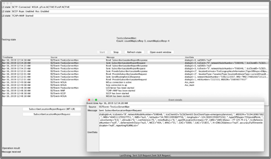

# Extended jSS7

> The Extended jSS7 is cloned from [RestComm jSS7](https://github.com/RestComm/jss7) from which we have added a set of improvements and new features listed in a later section of this file.
> 


## Introduction

Open Source Extended Java SS7 stack allows applications to communicate with legacy SS7 communications network nodes. 

Extended jSS7 provides implementation of SS7 stack layers `MTP2`, `MTP3`, `ISUP`, `SCCP`, `TCAP`, `CAMEL (Phase I, Phase II, Phase III and Phase IV)` and 
`MAP`. It also has in-built support for `SIGTRAN (SCTP/M3UA)` over IP and strictly adheres to the standards and specifications defined by the International Telecommunications Union (ITU), the 3rd Generation Partnership Project (3GPP), and the Internet Engineering Task Force (IETF). The 
platform offers a flexible API set for developers that hides underlying Telecom infrastructure and thus making it easier to implement SS7 services as well as 
migrating their applications over Time Division Multiplexing (TDM) equipments to SS7 over IP (SIGTRAN). {this-platform}  {this-application}  is based on an easily scalable and configurable load-balancing architecture.

Extended jSS7 supports TDM hardware offered by major vendors in the market, namely Intel family boards (Dialogic) and  Zaptel/Dahdi (Digium, Sangoma). For production purposes, Dialogic boards with MTP2 and MTP3 on-board are the only ones tested and therefore recommended.

If you intend to use `SIGTRAN` only (recommended), you can install the Extended jSS7 on any Operating System that supports Java and _Stream Control Transmission Protocol_ (SCTP). Any flavour of Linux OS supports SCTP natively or through an easy installation of Linux Kernel SCTP libraries/dev tools.

Extended jSS7 makes JAIN-SLEE TCAP, MAP, CAP and ISUP Resource Adaptors (RA) development possible, which enable developers to build SS7 applications with ease. They would only require an understanding of JAIN-SLEE Resource Adaptors and can focus on building applications quickly and efficiently rather than worrying about the underlying SS7 stack. If you wish to use JAIN-SLEE Resource Adaptors, the Command Line Interface (CLI - Shell Management tool) or the Graphic User Interface (GUI) for run-time configuration, then you must have either JBoss or WildFly Application Server installed and running. Anyway, if you do not wish to use the Resource Adaptors, then Extended jSS7 can work as a standalone library. 

The Open Source Software gives you the flexibility to understand the readily available source code and customise the product for your Enterprise needs. 


## Build Extended jSS7 

### Pre-Requisites for Building from Source

* `Git Client`: Instructions for using GIT, including install, can be found at http://git-scm.com/book
* `Maven 3.2.X`: Instructions for using Maven, including install, can be found at http://maven.apache.org/
* `Ant 1.9.X`: Instructions for using Ant, including install, can be found at http://ant.apache.org
* `jmxtools:jar`:  This library is required to build the Simulator source code. The library `com.sun.jdmk:jmxtools:jar:1.2.1` must be downloaded manually and placed in your maven repository. Instructions are provided below.


Here is the list of commands you need to run for building Extended-jSS7 from the source:

1. Clone jSS7 Repo : `git clone https://github.com/PAiC-team/Extended-jSS7`
2. Download Dialogic dependencies from Dialogic website. This is required to build the hardware part of jSS7 to have support for Dialogic boards in case you can't use SIGTRAN directly : `wget https://www.dialogic.com/files/DSI/developmentpackages/linux/dpklnx.Z`
3. Unpack the contents of the Dialogic SS7 dependencies : `tar --no-same-owner -zxvf dpklnx.Z`
4. Install the Dialogic SS7 Java Dependency in your local maven repository : `mvn install:install-file -DgroupId=com.vendor.dialogic -DartifactId=gctapi -Dversion=6.7.1 -Dpackaging=jar -Dfile=./JAVA/gctApi.jar`
5. Download Sun JMX tools dependency used by the jSS7 simulator : `wget http://www.datanucleus.org/downloads/maven2/com/sun/jdmk/jmxtools/1.2.1/jmxtools-1.2.1.jar`
6. Install the Sun JMX Tools Dependency in your local maven repository : `mvn install:install-file -DgroupId=com.sun.jdmk -DartifactId=jmxtools -Dversion=1.2.1 -Dpackaging=jar -Dfile=jmxtools-1.2.1.jar`
7. Build jSS7 with maven : `mvn clean install -Dmaven.test.skip=true`
8. Enjoy the best SS7 Open Source Stack out there ;) !

Note: For deploying of binaries into a local JBoss AS you need to configure a JBOSS_HOME environmental variable to a JBOSS folder and run following mvn commands:

1. `mvn clean install -Pdeploy-module-jboss5 -Dmaven.test.skip=true` (for JBoss 5.1 server)
2. `mvn clean install -Pdeploy-module-wildfly -Dmaven.test.skip=true` (for WildFly 10 server)


## Generate Wildfly Version
To generate a wildfly version of the Extended jSS7 use the following steps

- Download the Restcomm SLEE version 7.2.0-68.76 from WildFly 10.1.0.Final
- Build the Extended jSS7 using the command below 
  ```bash
  cd release
  ant -f build.xml -Drelease.version=8.3.0 -Dsctp.version=2.0.2-12
  ```
- Unzip the Extended jSS7 file and run the command below to install it
  ```sh
  cd Extended-jSS7-8.3.0/ss7-wildfly
  ant -f build.xml -Djboss.home=../../wildfly-10.1.0.Final
  ```
- NOTE: the path `../../wildfly-10.1.0.Final` indicates the path for the Restcomm SLEE downloaded above.


## Build Docker
To build a docker image you can use the script below. The script below only serves as a guide, and you can modify it by adding or removing as per your 
requirements.

```dockerfile
FROM amazoncorretto:8-alpine
RUN apk add net-tools lksctp-tools supervisor lksctp-tools-dev
RUN mkdir -p /opt/paic/jss7
WORKDIR /opt/paic/jss7
COPY Extended-jSS7-8.3.0-wildfly/. .
RUN chmod +x wildfly-10.1.0.Final/bin/standalone.sh
ENTRYPOINT ["sh", "wildfly-10.1.0.Final/bin/standalone.sh"]
CMD ["-b", "0.0.0.0"]
```


## Changelog by August 2021

* Upgrade Extended-jSS7 to run over JDK 11.

* JMX integration with WildFly.

* Integration of native automatic configurable monitoring routines, allowing automatic restart feature when ASP is not in Active state, while the AS is Active, without depending on external library integration. It is included now as a sniffer library.

* Native integration with Prometheus without dependencies of external libraries.

* A metric endpoint consumed by Prometheus providing the following monitoring and key parameter indicators:
  - SCTP association status
  - M3UA AS status
  - M3UA ASP status
  - M3UA Tx messages number
  - M3UA Rx messages number
  - MTP3 payload

* Restored features from the discontinued Restcomm community version:
  - Restored Operation and Maintenance libraries and Web GUI.
  - SCCP Routing by GT.
  - Statistic libraries.

* Kubernetes template to enable importing Extended jSS7 Docker images to Kubernetes clusters. It includes a supervisor configured to start the Extended jSS7 instance automatically.

* Implemented EUtranCgi (**EUTRAN CGI**), RAId (**ROUTEING AREA ID**) and TAId (**TRACKING AREA ID**) in map-api/impl within mobility/subscriberInformation 
  packages.

* Implemented `polygon` type of shape for additional location estimate for both **MAP PSL** (Provide Subscriber Location) and **MAP SLR** 
  (Subscriber Location Report) operations.

* Upgraded RequestedInfo/Impl to support remaining parameters as per release 15.5.0 of 3GPP TS 29.002 (MAP specification), including locationInformationEPS-Supported.

* Added `periodicLDR` option for DeferredLocationEventType.

* Implementation of `notificationVerificationOnly` option to Location Estimate Type as per release 15.5.0 of 3GPP TS 29.002 (MAP specification).

* Implemented **M3UA ERR** handling in M3UA Finite State Machine (see bug fixing section for further details), which solved a bug by which whenever an 
  M3UA ERR was received in reply to ASP ACTIVE (ASPAC), the ASP state kept in INACTIVE state forever unless a manual stop/start via CLI or manual restart of the service was carried out. As portrayed in the call flow example below, fixes included successful all the following possibilities:
  - ASPUP resending upon ASPUP timeout
  - ASPUP resending upon any MM3UA ERR occurrence
  - ASPAC resending upon ASPAC timeout
  - ASPAC resending upon any M3UA ERR occurrence
  
  


* Implementation of `M3ua_ManagementMessageHandler.xml` configuration file for **M3UA ERR** handling, including retry policy on specific M3UA ERR messages, including 
  - on/off flag for 
  whether there should be retransmission for ASPUP, ASPAC in case of specific M3UA ERR such as `Refused - Management Blocking` `Invalid Routing Context`, etc.
  - how many times such a retransmission should take place before giving up. An example of such configuration is shown next:

```
<?xml version="1.0" encoding="UTF-8" ?>
<errorManagement>
   <error name="refusedManagementBlocking" code="13" retry="-1" />
   <error name="invalidRoutingContext" code="25" retry="1"/>
   <error name="destinationStatusUnknown" code="20" retry="10"/>
</errorManagement>
```

* `M3ua_ManagementMessageHandler.xml` management via CLI and GUI.

* Several enhancements and additions in jSS7 simulator, namely:
  - Improved ATI_TEST_SERVER testing task with random answers for all types of location responses with all possible parameters, including error responses 
    for specific MSISDNs. Some parameters include binary data taken from real networks (obtained from Extended-GMLC), as well as some others matching 
    external cell databases such as the one from OpenCellId project. 
  - Fully implemented MAP_LCS_TEST_SERVER for MAP Location Services Management Services 
    (MAP SRILCS, MAP PSL and MAP SLR). It also includes all types of location responses with all possible parameters, including error responses for specific MSISDNs. Some parameters include binary data taken from real networks (obtained from Extended-GMLC), as well as some others matching external cell databases such as the one from [OpenCellId](https://www.opencellid.org/).

  - Implemented MAP_PSI_TEST_SERVER testing task with random answers for all types of subscriber information responses with all possible parameters, including error responses for specific MSISDNs. This task includes responses for MAP SRI, MAP SRISM and MAP PSI. Some parameters include binary data taken from real networks (obtained from Extended-GMLC), as well as some others matching external cell databases such as the one from [OpenCellId](https://www.opencellid.org/).

  - Enablement of TP-SRR handling – Delivery confirmation.
  
* Enhancements on jSS7 Management Console GUI:
  - Dropdown campaigns menu in Metrics
  - Administrator login / logout / security procedures

* Added Jenkinsfile for CI/CD release building.

* Implementation of MAP Stubs for SMS related operations load testing, namely:
  - MO-SMS MAP operations including MO-FSM.
  - MT-SMS MAP operations including MAP SRISM, MAP MT-FSM, MAP RSMDS (Report SM Delivery Status), MAP ASC (Alert Service Centre).

* Upgraded SCTP version to Extended-SCTP 2.0.2-13, which above all, now runs over JDK 11, but also includes several enhancements mostly for bad practices, typos/grammar mistakes, xml doc files improperly formatted, and renamed SCTP management configuration file for the following:
  - _extraHostAddresseSize_ parameter is now renamed adequately to _extraHostAddressesSize_.
  - _assoctype_ is now renamed as _associationType_.
  
* Upgraded Netty version to `4.0.36.Final`.

* Get/Set M3UA variables enabled `statisticsdelay` and `statisticsperiod` via the CLI, which retrieve/adjust the values.
```
<statisticsdelay value="5000"/>
<statisticsperiod value="5000"/>
```

* Fixed a bug for *M3UA ASP* command line (CLI) restart.

* Fixed a bug for HTTP metric integration endpoint termination when restarting the jSS7 container.

* Resolved an issue in memory resource management where the Java Garbage Collector process freed the cache but did not reflect in the available memory, 
  causing Congestion Monitor events.

* Fixed GUI modification of a given _SAP MTP3 Destination_ which resulted in an _IllegalArgumentException_.

* Fixed _SAP MTP3 Destination_ modification CLI command not recognized as a valid command.

* Resolved the issue in which the CLI was not allowing changing the value of SSN for TCAP and thus returning _invalid command_.

* Fixed Modify Remote Subsystem Number (RSS) which was not working on the GUI for SCCP management.

* Fixed wrongly named methods (e.g., _removeAllResourses()_, _acivate()_, _isAvailavle()_, etc.), several typos/syntax/grammar errors in logs, comments, etc.

* Fixed _FileNotFoundException_ errors for both `MapStack_management.xml` and `CapStack_management.xml` configuration files when running the container for the first time.

* Fixed a hardcode in the calculation of the M3UA bytes length, by incorrectly using an array position from a _toString()_ method at the SnifferImpl class, potentially breaking the calculation if the aforementioned method changes in the future by any means.

* Fixed a bug by which the calculation of M3UA transmitted/received packets were being duplicated by the _SnifferImpl_ class.


## What is coming?

For details on our planned features and future direction please refer to [PAiC Business Development](https://paicbd.com/).

## News
For the latest news please refer to [PAiC Business Development](https://paicbd.com/).

## Stay in Touch
Tell us what’s working well, what you want to see added or improved, and find out about new updates:  [PAiC Business Development](https://paicbd.com/).

## Contribution
Thank you to the [RestComm](https://github.com/RestComm) community over which shoulders we stand. [PAiC Business Development](https://paicbd.com/) main contributors of all the additions, fixes and enhancements included in the changelog of this repository are listed in strict alphabetical order next:
- Tanieska Aguirre
- James Amo
- Giovanni Castillo
- Juan Carlos García
- Kenny Mendieta
- Fernando Mendioroz

## Credits
Thank you to all of [PAiC Business Development](https://paicbd.com/) customers that pushed us to these enhancements either via Extended-jSS7 standalone framework, or the multiple platforms using it (Extended-SMSC, Extended-GMLC, Extended-USSD Gateway, Extended-Signaling-Gateway, Home-Re-Routing).

## LICENSE
[GNU AFFERO GENERAL PUBLIC LICENSE](./LICENSE)

